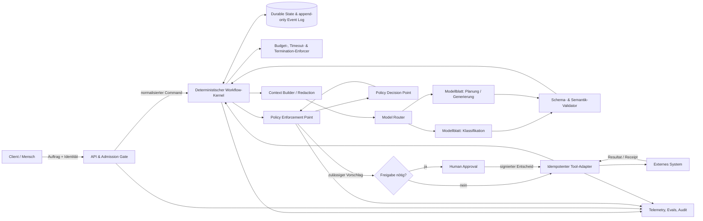

# Referenzarchitektur: deterministischer Kernel, probabilistische Blätter

[Kurzfassung](KURZFASSUNG.md) · [Beispielimplementierung](beispiel/README.md) · [Gesamtübersicht](../README.md)

Stand: 2026-07-22

## Kurzfassung

Die Zielarchitektur hält Identität, Berechtigungen, Zustandsübergänge, Budgets, Abbruchbedingungen und externe Nebenwirkungen in einem deterministischen Kontrollkern. Modelle sind **probabilistische Blätter**: Sie klassifizieren, extrahieren, planen oder erzeugen Kandidaten innerhalb versionierter, typisierter Verträge. Sie dürfen weder Berechtigungen erteilen noch einen Commit selbst vollziehen.

Die Architektur kann Grenzen wie „höchstens 20 Modellaufrufe“, „kein Tool ohne Autorisierung“ oder „kein Commit ohne passende Freigabe“ technisch erzwingen. Wiederaufnahme nach Ausfällen ist unter den Voraussetzungen einer dauerhaft gespeicherten Ereignishistorie, replay-sicherer Workflow-Logik und idempotenter beziehungsweise kompensierbarer Activities erreichbar. Inhaltliche Wahrheit, vollständige Prompt-Injection-Abwehr und Exactly-once-Nebenwirkungen werden nicht behauptet. Modellqualität bleibt statistisch zu messen.

Diese Position folgt dem Unterschied zwischen vorgegebenen Workflows und modellgesteuerten Agenten sowie der Empfehlung, mit der einfachsten ausreichenden Lösung zu beginnen ([Anthropic](https://www.anthropic.com/engineering/building-effective-agents)). Eine konkrete Implementierung darf Temporal, LangGraph oder eigenen Workflow-Code, OPA oder eine andere Policy Engine und unterschiedliche Modellanbieter verwenden; Garantien stammen aus den durchgängig geprüften Invarianten, nicht aus Produktnamen.

## Anwendungsbereich

Die Architektur ist für KI-gestützte Prozesse gedacht, die Daten lesen, Werkzeuge aufrufen oder Änderungen an externen Systemen vorbereiten. Beispiele sind Recherche, Dokumentenverarbeitung, Support-Triage, Code-Änderungsvorschläge und freigabepflichtige Geschäftsvorgänge.

Nicht gemeint ist ein Sicherheitsversprechen für beliebige autonome Agenten mit unbeschränktem Rechner-, Netz- oder Credential-Zugriff. Je höher Auswirkung, Irreversibilität und Unsicherheit einer Aktion, desto kleiner muss der modellgesteuerte Bereich sein. Für einen einzelnen risikoarmen Textentwurf kann ein einzelner Modellaufruf genügen; Multi-Agent- oder Multi-Modell-Strukturen sind nur nach einem evaluierten Mehrwert gegenüber dieser Baseline zulässig.

## Architekturprinzipien

1. **Code besitzt Kontrolle.** Nur der Zustandsautomat entscheidet, welcher Übergang zulässig ist. Ein Modell liefert Daten, keine Autorität.
2. **Deny by default.** Jede Capability ist an Identität, Zweck, Ressource, Mandant, Lauf und Ablaufzeit gebunden. Fehlende oder nicht verfügbare Policy-Entscheidungen führen bei schreibenden Aktionen zum Abbruch.
3. **Vorschlag und Wirkung sind getrennt.** Ein Modell erzeugt einen `ActionProposal`; nur der Tool-Adapter kann nach Policy, Validierung und gegebenenfalls Freigabe einen Commit ausführen.
4. **Jede Grenze ist explizit.** Schema, Größe, Zeit, Kosten, Schrittzahl, Parallelität und erlaubte Zielsysteme werden vor Ausführung geprüft.
5. **Nebenwirkungen liegen außerhalb des Replay-Kerns.** Netzwerk, Zeit, Zufall und Modellaufrufe werden als Activities mit aufgezeichnetem Ergebnis behandelt. Durable-Execution-Systeme rekonstruieren Zustand aus einer Event History; das setzt deterministische Replay-Logik voraus ([Temporal](https://docs.temporal.io/workflow-execution)).
6. **Beobachtbarkeit ohne Geheimnis-Sammlung.** Audit-Ereignisse enthalten Identitäten, Entscheidungen, Versionen und Hashes, aber standardmäßig weder Secrets noch private Chain-of-Thought.
7. **Komplexität verdient sich ihre Zulassung.** Zusätzliche Modelle oder Agenten müssen definierte Qualitäts-, Risiko-, Latenz- und Kostengates passieren.

## Logische Zielarchitektur



Das Diagramm trennt **Kontrollfluss** (durchgezogene Entscheidungskette des Kernels) von **Datenfluss** (Kontext, Modellresultat, Toolresultat und Ereignisse). In einer physischen Implementierung sollten sensible Nutzdaten separat verschlüsselt gespeichert werden; das Ereignislog kann stattdessen Referenzen und Integritätshashes halten.

## Kontrollfluss

### 1. Aufnahme und Admission

Das API-Gateway authentisiert den Aufrufer, bindet Mandant und Zweck, prüft Eingabegröße und Rate Limit und erzeugt `run_id`, `request_id` und ein unveränderliches `policy_context`. Unbekannte Versionen, unzulässige Datenklassen und fehlende Pflichtfelder werden vor jedem Modellaufruf abgewiesen.

### 2. Deterministische Orchestrierung

Der Kernel wählt anhand des aktuellen Zustands und eines versionierten Workflows genau die zulässigen Folgezustände. Er verwaltet Zähler und Fristen atomar mit dem Übergang. Dynamische Modellplanung darf nur eine Liste typisierter Vorschläge erzeugen; der Kernel entscheidet, ob ein Vorschlag in der aktuellen Phase zulässig ist.

### 3. Kontextaufbau und Modellaufruf

Der Context Builder lädt nur für diesen Schritt erlaubte Daten, markiert Herkunft und Vertrauensstufe und redigiert Secrets. Der Router wählt aus einer freigegebenen Modellliste anhand einer deterministischen Policy; ein statistischer Router darf Kandidaten empfehlen, aber Budget-, Datenresidenz- und Capability-Grenzen nicht überschreiben. Modellantworten nutzen, soweit verfügbar, constrained decoding beziehungsweise Structured Outputs. Diese können Schema-Konformität herstellen, nicht semantische Richtigkeit ([OpenAI](https://openai.com/index/introducing-structured-outputs-in-the-api/)).

### 4. Validierung

Die Pipeline prüft in dieser Reihenfolge:

1. Transportstatus, Abbruch oder Verweigerung;
2. Größe, Encoding und JSON-Schema;
3. referenzielle und domänenspezifische Invarianten;
4. Provenienzpflichten, erlaubte Ressourcen und Datenklassifikation;
5. risikobasierte Schwelle für menschliche Freigabe.

Ein Fehler wird als typisiertes Ereignis festgehalten. Nur explizit retrybare Fehler werden mit begrenztem Backoff wiederholt. Ein „Reparaturprompt“ ist ein neuer probabilistischer Versuch und verbraucht Budget; er ersetzt keinen Validator.

### 5. Policy und Commit

Der Policy Enforcement Point (PEP) sendet strukturierte Fakten an einen Policy Decision Point (PDP), etwa Identität, Rolle, Zweck, Tool, Ziel, Datenklasse, Risikostufe und bisheriges Budget. OPA trennt Entscheidung von Durchsetzung ausdrücklich; deshalb muss der Adapter die Entscheidung auch tatsächlich erzwingen ([OPA](https://www.openpolicyagent.org/docs)).

Schreibende Aufrufe erhalten einen serverseitig erzeugten `idempotency_key = H(run_id, action_id, canonical_payload, target)`. Der Adapter prüft diesen Schlüssel in einem Deduplication Store, schreibt eine Outbox-Absicht und führt erst danach die externe Aktion aus. Bei nicht idempotenten Zielsystemen gelten entweder ein atomarer Provider-Schlüssel, eine verifizierte Vorbedingung plus Receipt oder eine Saga mit fachlicher Kompensation. „Exactly once“ wird nicht aus Retry oder Persistenz abgeleitet.

### 6. Abschluss

Der Kernel akzeptiert nur ein Terminalereignis, wenn alle erforderlichen Receipts, Freigaben und Ergebnisvalidierungen vorhanden sind. Die Antwort nennt Status und Unsicherheit; Teilfehler werden nicht als Erfolg maskiert. Das Audit enthält Workflow-, Prompt-, Policy-, Schema-, Tool- und Modellversionen sowie Kosten- und Laufzeitdaten.

## Datenfluss und Vertrauenszonen

| Zone | Typische Daten | Zulässige Richtung | Technische Kontrolle |
|---|---|---|---|
| Client-Zone | Auftrag, Anhänge | nur über Admission | AuthN, Größenlimit, Malware-/Formatprüfung |
| Kontrollzone | Zustände, Policies, Budgets | Kernel ist alleiniger Schreiber | Transaktionen, ACL, versionierte Artefakte |
| Modellzone | minimierter Kontext, Kandidat | keine direkte Verbindung zu Zielsystemen | Egress-Allowlist, kurzlebige Credentials oder keine Credentials |
| Tool-Zone | validierter Action Request | nur PEP → Adapter → Ziel | Capability Token, Idempotenz, Ziel-Allowlist |
| Audit-Zone | Events, Hashes, Entscheidungen | append-only; getrennte Leserollen | Verschlüsselung, Retention, Redaction, Integritätsprüfung |

Untrusted Content bleibt als Daten markiert und wird nie in eine höher privilegierte Instruktionsschicht kopiert. Ein Modellprozess erhält kein generisches Cloud-Token. Für MCP-basierte Tools sind Access Tokens auf den vorgesehenen Empfänger zu binden und zu validieren; Token-Passthrough ist in der MCP-Autorisierungsspezifikation verboten ([MCP Authorization 2025-06-18](https://modelcontextprotocol.io/specification/2025-06-18/basic/authorization)).

## Zustandsmodell

Ein minimaler Laufzustand lautet:

```text
RECEIVED
  -> ADMITTED | REJECTED
ADMITTED
  -> CONTEXT_READY | FAILED | CANCELLED
CONTEXT_READY
  -> MODEL_PENDING
MODEL_PENDING
  -> CANDIDATE_READY | RETRY_WAIT | FAILED | BUDGET_EXHAUSTED
CANDIDATE_READY
  -> VALIDATED | REJECTED_CANDIDATE
VALIDATED
  -> POLICY_ALLOWED | POLICY_DENIED | APPROVAL_PENDING
APPROVAL_PENDING
  -> POLICY_ALLOWED | POLICY_DENIED | EXPIRED | CANCELLED
POLICY_ALLOWED
  -> COMMITTING
COMMITTING
  -> COMMITTED | RETRY_WAIT | COMPENSATION_PENDING | MANUAL_RECONCILIATION
COMMITTED
  -> VERIFIED | MANUAL_RECONCILIATION
VERIFIED | REJECTED | FAILED | CANCELLED | BUDGET_EXHAUSTED | EXPIRED
  -> TERMINAL
```

Zulässige Übergänge sind eine Allowlist. Jeder Übergang prüft `expected_state` und eine monotone `state_version`; konkurrierende oder verspätete Ergebnisse werden abgewiesen. Ein Approval bindet den Hash des konkreten Vorschlags, die approvierende Identität, Umfang und Ablaufzeit. Jede Payload-Änderung invalidiert es. `COMMITTING` ist bewusst nicht automatisch gleich `COMMITTED`: Nach einem Timeout kann die Außenwirkung unklar sein und muss über einen Provider-Receipt oder Read-after-write geklärt werden.

### Ereignisvertrag

Jedes Ereignis enthält mindestens:

```json
{
  "event_id": "uuid",
  "run_id": "uuid",
  "sequence": 17,
  "state_before": "VALIDATED",
  "state_after": "APPROVAL_PENDING",
  "event_type": "approval.requested",
  "actor": {"type": "service", "id": "kernel"},
  "artifact_versions": {"workflow": "sha256:…", "policy": "sha256:…"},
  "payload_ref": "encrypted://…",
  "payload_hash": "sha256:…",
  "occurred_at": "server timestamp"
}
```

Zeitstempel sind Auditdaten, nicht die Ordnungsquelle; Reihenfolge entsteht aus der atomar vergebenen Sequenz. Ereignisse werden angehängt, nicht überschrieben. Korrekturen sind neue Ereignisse.

## Technische Mechanismen

### Kernel

- versionierter Zustandsautomat mit vollständiger Übergangstabelle;
- atomare Zustandsänderung plus Event-Append;
- harte Caps für Calls, Tokens/Kosten, Wall Clock, Tool-Aktionen und Parallelität;
- explizite Termination und Cancellation Propagation;
- deterministische Router-Regeln für Risiko und Capabilities;
- Replay-Tests jeder Workflow-Version gegen historische Ereignisse.

### Probabilistische Blätter

- eine eng begrenzte Aufgabe pro Aufruf;
- versionierter Prompt, Modell-Snapshot und Dekodierparameter;
- strukturierter Antwortvertrag mit `additionalProperties: false` und begrenzten Längen/Enums;
- keine Autorisierungsentscheidung und keine direkten Credentials;
- Evals pro Aufgabe, Sprache, Datenklasse und Failure Mode;
- Fallback ist explizit: anderes freigegebenes Modell, menschliche Bearbeitung oder sicherer Abbruch.

### Tool-Adapter

- getrennte Read- und Write-Tools; kleine, poka-yoke-artige Schnittstellen;
- serverseitige Zielauflösung und Allowlist statt frei formulierter URLs oder Shell-Befehle;
- Policy-Prüfung bei **jedem** Aufruf, nicht nur beim Laufstart;
- kurzlebige, zielgebundene Credentials und minimale Scopes;
- Dry Run, Idempotency Key, Outbox, Receipt und Reconciliation;
- isolierte Ausführung. gVisor reduziert durch einen Userspace-Kernel den direkten Kontakt zum Host-Kernel, während Firecracker microVMs unter anderem KVM, seccomp, cgroups, Namespaces und einen Jailer als Defense in Depth kombinieren; beides reduziert Angriffsfläche, beseitigt aber weder Fehlkonfigurationen noch alle Seitenkanäle ([gVisor](https://gvisor.dev/docs/architecture_guide/security/), [Firecracker](https://github.com/firecracker-microvm/firecracker/blob/main/docs/design.md)).

### Telemetrie und Evidenz

- korrelierte Spans für Run, Modellaufruf, Policy-Entscheidung, Approval und Tool-Aufruf;
- getrennte Sicherheits-, Qualitäts- und Betriebsmetriken;
- redigierte Auditlogs mit Zugriffskontrolle und Löschfristen;
- deterministische Grader zuerst; LLM-as-Judge nur kalibriert und als statistisches Signal;
- Release-Manifest mit Artefakthashes, Eval-Ergebnis, Risikoakzeptanz und Rollback-Ziel.

## Garantie-Ledger

Die IDs `A1` bis `A10` bezeichnen einzelne Architekturaussagen; ihre Klasse folgt der G1–G4-Taxonomie aus [Kapitel 00](../00-garantie-taxonomie.md).

| ID | Aussage | Klasse | Voraussetzungen / Scope | Nachweis | Nicht abgedeckt |
|---|---|---|---|---|---|
| A1 | Kein Zustandsübergang außerhalb der Transition-Allowlist | deterministisch erzwingbar | alle Schreiber gehen durch Kernel; DB-ACL verhindert Bypass | Unit-/Property-Tests, DB-Audit | kompromittierter Kernel/DB-Admin |
| A2 | Kein Tool-Aufruf nach Überschreiten eines harten Laufbudgets | deterministisch erzwingbar | atomarer Zähler; jeder Adapter verlangt gültiges Lease | Grenzwert- und Concurrency-Tests | bereits begonnene, extern nicht abbrechbare Aktion |
| A3 | Kein schreibender Adapteraufruf ohne aktuelle Allow-Entscheidung | deterministisch erzwingbar | fail-closed PEP ohne Bypass; Policy und Input versioniert | Negativtests, Decision Log | fehlerhafte Policy erlaubt Unerwünschtes |
| A4 | Freigabe gilt nur für exakt den approvierten Payload-Hash | deterministisch erzwingbar | Signaturprüfung, Ablaufzeit, unveränderliche Kanonisierung | Tamper-Tests | Mensch beurteilt Inhalt falsch |
| A5 | Modelloutput ist syntaktisch schema-konform oder wird verworfen | deterministisch erzwingbar | Validator liegt vor jedem Consumer; Verweigerung/Trunkierung separat | Contract-/Fuzz-Tests | Wahrheit, Vollständigkeit, sichere Bedeutung |
| A6 | Lauf kann nach Worker-Ausfall ab letztem persistierten Ereignis rekonstruiert werden | unter Annahmen garantiert | hochverfügbarer Store, deterministischer Replay, versionierter Code | Crash-/Replay-Tests | verlorener Store, inkompatible Migration |
| A7 | Retry erzeugt höchstens eine fachlich sichtbare Wirkung | unter Annahmen garantiert | Ziel unterstützt atomare Idempotency Keys **oder** Adapter kann Wirkung eindeutig feststellen | Fault Injection, Provider-Receipt | nicht idempotentes Ziel ohne Abfrage/Transaktion |
| A8 | Qualität liegt oberhalb definierter Schwelle auf Zielverteilung | statistisch messbar | repräsentatives, versioniertes Eval-Set; Konfidenzintervall; Driftmonitoring | Offline-Eval und Canary | Einzelfallkorrektheit, unbekannte Verteilung |
| A9 | Latenz/Kosten/Fehlerrate halten SLOs | statistisch messbar | vollständige Telemetrie, definierte Messfenster | Dashboards, Burn-Rate-Alerts | zukünftige Provider-Ausfälle |
| A10 | Zweites Modell oder Selbstkritik verbessert schwierige Antworten | heuristisch bis evaluiert | nur nach kontrolliertem Vergleich auf Zielaufgaben | A/B-Test | Wahrheitsbeweis oder Unabhängigkeit korrelierter Modelle |

Jede Produktionsgarantie braucht einen Owner, eine automatisierte Evidence-Quelle, ein Prüfintervall und eine Reaktion bei Bruch. Ohne durchgängigen Enforcement Point ist sie nur eine Designabsicht.

## Threat Model

### Schutzgüter und Angreifer

Schutzgüter sind Nutzer- und Unternehmensdaten, Secrets, externe Systeme, Freigabeintegrität, Budget, Event History sowie die Korrektheit der Policy- und Workflow-Artefakte. Betrachtet werden bösartige Nutzer, kompromittierte Datenquellen oder Toolserver, Prompt Injection in Dokumenten, ein fehlgeleitetes Modell, ein kompromittierter Worker und Fehlkonfigurationen durch Betreiber. OWASP ordnet agentische Risiken unter anderem entlang Tool-, Ziel-, Identitäts-, Gedächtnis-, Berechtigungs- und Multi-Agent-Interaktionen ein ([OWASP Agentic AI](https://genai.owasp.org/resource/agentic-ai-threats-and-mitigations/)).

| Bedrohung | Angriffspfad | Primäre Kontrolle | Restrisiko / Reaktion |
|---|---|---|---|
| Indirekte Prompt Injection | Dokument fordert Secret-Exfiltration oder Tool-Aufruf | Herkunftsmarkierung, Trennung von Daten/Instruktionen, keine Credentials im Modell, PEP, Egress-Allowlist | semantische Manipulation bleibt möglich; blocken, alarmieren, Eval erweitern |
| Tool Misuse / Confused Deputy | Modell nutzt legitimes Tool für fremde Ressource | nutzer- und zielgebundene Capability, serverseitige Ressourcenzuordnung, Consent | fehlerhafte Ressourcenzuordnung; negative Autorisierungstests |
| Token-Diebstahl oder -Weitergabe | Toolserver erhält zu mächtiges Token | kurzlebige Audience-/Scope-Bindung, Vault, kein Token-Passthrough | kompromittierter Zielserver; Rotation und Incident Response |
| Memory Poisoning | manipulierte Erinnerung beeinflusst spätere Runs | provenance, getrennte Trust-Tiers, Schreib-Policy, TTL, Quarantäne | legitime Falschinformation; Review und Rebuild |
| Privilege Escalation | Modell oder Worker umgeht PEP | Netzwerk- und IAM-Zwangspfad, DB-ACL, getrennte Service-Identitäten | Kernel-/Cloud-Control-Plane-Kompromittierung; Defense in Depth |
| Replay/Doppelwirkung | Timeout löst erneuten Commit aus | Idempotency Key, Outbox, Receipt, Reconciliation | Ziel ohne Idempotenz; auf manuelle Klärung statt Blind-Retry |
| Approval Spoofing / TOCTOU | Payload nach Freigabe geändert | signierter Payload-Hash, Ablaufzeit, erneute Policy-Prüfung direkt vor Commit | kompromittierter Approver; Vier-Augen-Prinzip nach Risiko |
| Budget-/Loop-Angriff | endlose Delegation oder Tool-Schleife | harte Caps, Deadline, maximale Tiefe/Breite, Cancellation | Ressourcen bis Cap verbraucht; Rate Limit und Quota |
| Datenabfluss über Telemetrie | Prompts oder Toolresultate in Logs | default-off Payload Logging, Feldmaskierung, getrennte Rollen, Retention | Operatorzugriff; DLP und regelmäßige Stichprobe |
| Supply-Chain-Manipulation | Prompt/Policy/Image verändert | signierte Artefakte, Hash-Pinning, attestierter Build, Deployment Gate | legitimer aber schädlicher Change; Review und Rollback |
| Inter-Agent-Vertrauensfehler | Worker-Ausgabe gilt als verifiziert | jedes Handoff als untrusted typed message, Validator und Provenienz | korrelierte Fehler; unabhängige deterministische Prüfung |

## Nicht-Garantien und Failure Modes

- Ein valides Schema garantiert weder wahre Fakten noch zulässige Geschäftsbedeutung.
- Ein persistierter Lauf garantiert keine Exactly-once-Wirkung außerhalb der Transaktionsgrenze.
- Sandboxing reduziert Angriffsfläche; es garantiert keine vollständige Isolation gegen Kernel-, Hypervisor-, Seitenkanal- oder Konfigurationsfehler.
- Policy-as-Code garantiert nur die implementierte Policy. Falsche Regeln, veraltete Daten oder ein umgangener Enforcer bleiben Risiken.
- Auditierbarkeit garantiert nicht automatisch Vollständigkeit, wenn alternative Schreibpfade existieren.
- Menschliche Freigabe garantiert keine korrekte Entscheidung; sie schafft Zurechnung und eine zusätzliche Kontrollstelle.
- LLM-as-Judge, Selbstkritik, Debatte und Mehrheitsentscheid sind keine Wahrheitsbeweise.
- Formale Prüfung eines Zustandsmodells beweist Eigenschaften des Modells, nicht automatisch dessen Code oder Betriebsumgebung. TLA+ trennt Spezifikation und Implementierung; die Modell-Code-Lücke muss durch Conformance- und Runtime-Tests adressiert werden ([Lamport, *Specifying and Verifying Systems with TLA+*](https://lamport.org/pubs/spec-and-verifying.pdf)).

Typische sichere Fehlerreaktionen sind `POLICY_DENIED`, `BUDGET_EXHAUSTED`, `MANUAL_RECONCILIATION` oder `FAILED`, niemals ein stilles Fortsetzen mit weniger Kontrollen.

## Entscheidungskriterien

### Workflow oder Agent?

Ein fester Workflow ist Default, wenn zulässige Schritte, Abschlusskriterium und Risiken vorab modellierbar sind. Ein dynamischer Agent ist nur sinnvoll, wenn der Pfad wirklich offen ist, Erfolg aus Ground Truth geprüft werden kann und harte Caps sowie eine Sandbox bestehen. Hohe Irreversibilität spricht unabhängig von Modellqualität für engere Workflows und Freigaben.

### Single- oder Multi-Modell?

Ein zweites Modell wird nur zugelassen, wenn ein versionierter Test zeigt, dass sein marginaler Nutzen die zusätzlichen Fehlerflächen, Kosten und Latenzen rechtfertigt. Für kritische Checks sind deterministische Regeln oder unabhängige Datenquellen einem weiteren Sprachmodell vorzuziehen.

### Durable Engine oder einfache Queue?

Eine einfache transaktionale Queue genügt für kurze, idempotente Einzelschritte. Durable Execution wird relevant bei langen Pausen, Human-in-the-loop, mehreren Retries/Compensations oder Wiederaufnahme über Deployments hinweg. Sie verlangt Versions- und Replay-Disziplin.

### Isolationsstufe

- keine Codeausführung: Prozess-/Containergrenzen plus restriktives IAM können genügen;
- untrusted Parser oder Tools: verstärkte Container-Sandbox, kein Default-Netz;
- untrusted Code: kurzlebige VM/microVM, read-only Basis, ephemeres Dateisystem, explizite Egress-Proxies;
- besonders sensible Daten: separate Konten/Projekte, starke Mandantentrennung und gegebenenfalls keine Modellweitergabe.

## Umsetzbare Checkliste

### Vor Produktivsetzung

- [ ] Zustände, erlaubte Übergänge und Terminalzustände sind versioniert und getestet.
- [ ] Jeder externe Effekt hat Owner, Risikoklasse, PEP, Timeout und Recovery-Verhalten.
- [ ] Alle schreibenden Tools sind deny-by-default und nicht direkt aus der Modellzone erreichbar.
- [ ] Idempotenz- und Reconciliation-Vertrag ist pro Tool dokumentiert und mit Fault Injection getestet.
- [ ] Approval bindet Identität, Scope, Payload-Hash und Ablaufzeit.
- [ ] Modellantworten werden syntaktisch und danach domänenspezifisch validiert.
- [ ] Calls, Tokens/Kosten, Zeit, Parallelität und Delegationstiefe besitzen harte Caps.
- [ ] Replay-Tests laufen gegen repräsentative historische Event Histories.
- [ ] Secrets, personenbezogene Daten und Tool-Payloads sind in Logs minimiert/redigiert.
- [ ] Threat Model enthält Prompt Injection, Confused Deputy, Memory Poisoning und Doppelwirkung.
- [ ] Baseline-Evals und produktionsnahe Failure-Injection-Tests bestehen.
- [ ] Canary, Kill Switch, manuelle Reconciliation und Rollback sind geübt.

### Im Betrieb

- [ ] Policy-, Workflow-, Prompt-, Modell- und Tool-Version sind je Run rekonstruierbar.
- [ ] Alerts unterscheiden Qualitätsdrift, Policy-Denials, Budgetabbrüche und Infrastrukturfehler.
- [ ] Offene `COMMITTING`- oder `MANUAL_RECONCILIATION`-Fälle haben SLA und Owner.
- [ ] Neue Modelle, Tools, Rechte oder Datenklassen durchlaufen erneut das passende Release-Gate.
- [ ] Garantie-Ledger und Threat Model werden nach Incidents und mindestens je Release überprüft.

## Weiterführende Dokumente

Siehe [Garantie-Taxonomie](../00-garantie-taxonomie.md), [Durable Execution](../03-durable-execution/), [Verträge und Policy-Gates](../04-vertraege-policy-gates/), [Sicherheit und Isolation](../05-sicherheit-und-isolation/), [Evaluation und Observability](../06-evaluation-observability/) sowie den [Einführungsplan](../10-einfuehrungsplan/).
