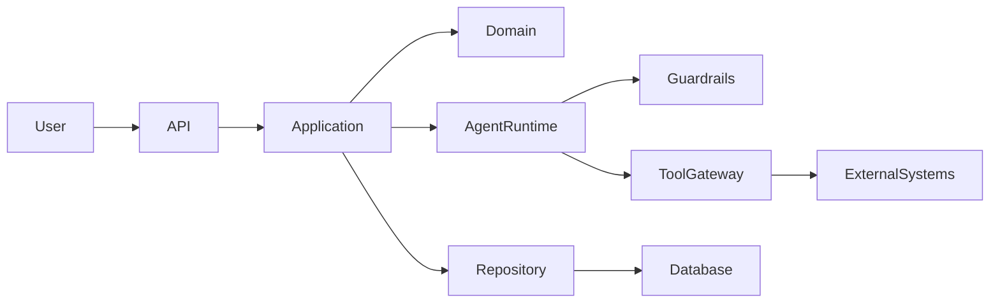

# Architecture

## System context

`<Project Name>` allows `<actor>` to `<primary capability>`.

It integrates with:

- `<identity provider>`
- `<database>`
- `<external service>`
- `<model provider, if applicable>`

## Design goals

1. Business rules remain independent of infrastructure.
2. External effects pass through explicit, testable interfaces.
3. Untrusted model output cannot directly perform privileged operations.
4. Important operations are observable and auditable.
5. Components can be tested without live external services.

## Non-goals

- `<explicitly unsupported use case>`
- `<scale or platform not currently targeted>`
- `<autonomous action intentionally requiring human approval>`

## Component model

## Layers

### Domain

Contains entities, value objects and business rules.

**May depend on:** standard library and domain-owned abstractions.

**Must not depend on:** HTTP, databases, model SDKs, queues or frameworks.

### Application

Coordinates use cases and transactions.

**May depend on:** domain interfaces.

**Must not contain:** vendor-specific infrastructure implementation.

### Infrastructure

Implements persistence, HTTP clients, message handling and model-provider
adapters.

### Agent runtime

Responsible for:

- instruction assembly
- model invocation
- structured output validation
- tool selection and execution
- retry and stopping policies
- human approval checkpoints
- traces and evaluation hooks

## Agent execution flow

1. Authenticate the caller.
2. Authorize the requested operation.
3. Validate and classify the input.
4. Build the minimum necessary context.
5. Invoke the model with explicit limits.
6. Parse the response into a typed schema.
7. Validate proposed tool calls.
8. Request approval for consequential actions.
9. Execute tools through the tool gateway.
10. Record the result and relevant trace metadata.
11. Stop when success or an execution limit is reached.

## Trust boundaries

| Boundary | Threat | Control |
|---|---|---|
| User -> API | Malformed or unauthorized input | Authentication, authorization, validation |
| Retrieved data -> model | Prompt injection | Isolation, content labeling, restricted tools |
| Model -> tool gateway | Fabricated or harmful arguments | Schema validation and policy checks |
| Tool -> external system | Excessive privileges | Scoped credentials and allowlists |
| Agent -> human | Misleading output | Evidence, uncertainty and confirmation UI |

## Architectural invariants

These rules must remain true:

1. Domain code does not import infrastructure code.
2. The model never receives unrestricted production credentials.
3. Tool authorization is enforced outside the model.
4. High-risk writes require an approval record.
5. Every agent run has bounded retries, duration and tool calls.
6. Agent behavior changes are covered by evaluations.

## Data ownership

| Data | Owner | Storage | Retention |
|---|---|---|---|
| User account | `<component>` | `<store>` | `<policy>` |
| Agent trace | `<component>` | `<store>` | `<policy>` |
| Evaluation result | `<component>` | `<store>` | `<policy>` |

## Failure handling

- Transient external failures use bounded exponential backoff.
- Non-transient failures are returned without blind retries.
- State-changing operations use idempotency keys where practical.
- Partial failures emit structured audit events.
- The agent stops after exceeding any configured execution limit.

## Observability

Record:

- request and trace IDs
- agent and prompt versions
- model and tool identifiers
- latency, token and cost metrics
- tool-call outcomes
- guardrail decisions
- approval decisions
- final status and stop reason

Secrets and sensitive content must be redacted before recording.

## Related decisions

- [ADR-0001: Initial architecture](docs/decisions/0001-initial-architecture.md)
- [ADR-0002: Agent tool authorization](docs/decisions/0002-tool-authorization.md)
